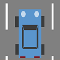

# Traffic Game
Traffic Game 
Version 0.5a

Traffic Game is a game written in Microsoft Small Basic programming language.

## System Requirements
- Windows Vista or lator
- .NET Framework 4.5 or later

## Usage
- Hit [↑]/[↓] keys to speed car up/down.
- Hit [←]/[→] keys to move car left/right.

## Source Programs
- TrafficGame.sb - Traffic Game
- BurstMaker.sb - A tool to make burst shape

## Version History
- 0.5a 2017-05-20 Supported arrow key input.
- 0.4a 2017-05-20 Renamed.
- 0.3a 2017-05-20 Added another car and bug fixed #1.
- 0.2a 2017-05-20 Added a blow shape.
- 0.1a 2017-05-15 Created as a demo.
